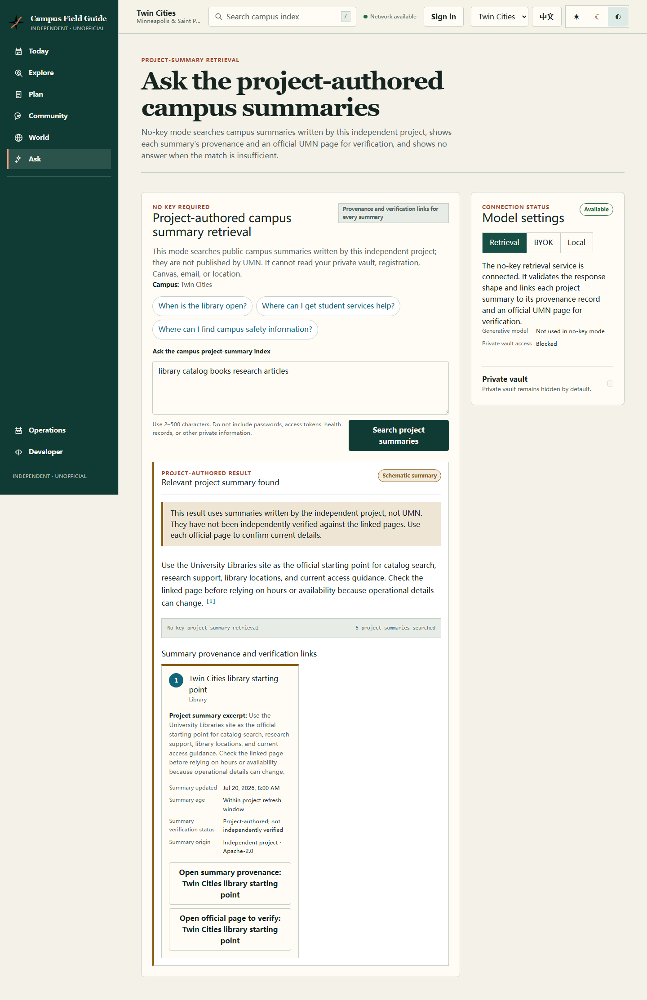
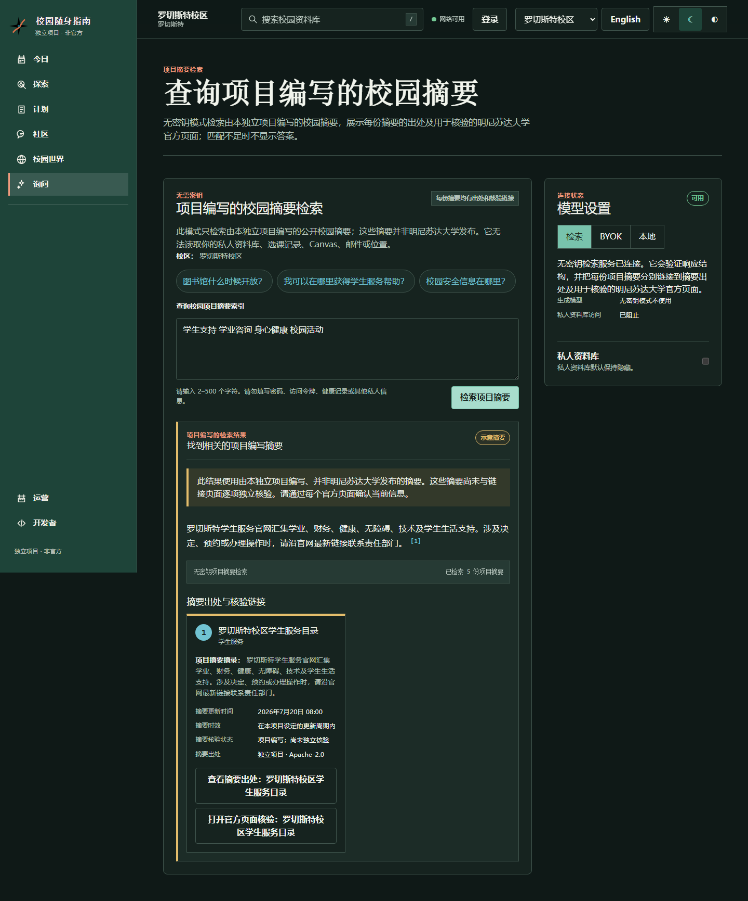
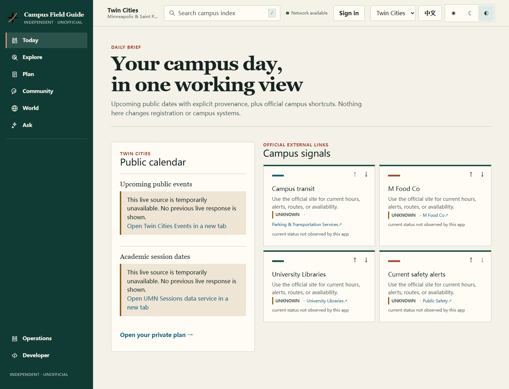
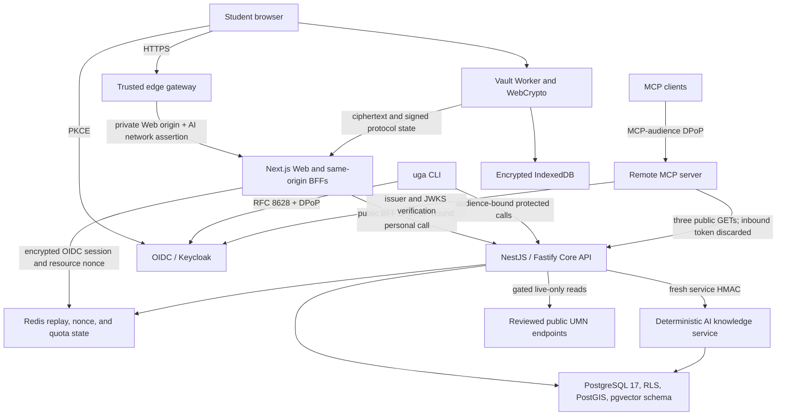

# UMN Gopher Assistant

An independent, bilingual campus companion for the University of Minnesota's
Twin Cities, Duluth, Crookston, Morris, and Rochester campuses. The platform
combines a provenance-first public field guide, deterministic campus knowledge
retrieval, an end-to-end encrypted personal planner, and secure developer
interfaces in one schema-first monorepo.

> **Independent and unofficial.** UMN Gopher Assistant is not operated,
> sponsored, endorsed, or approved by the University of Minnesota. University
> names identify the campuses this software is designed to support. Do not use
> this project for emergencies, evacuation, accessible-route guarantees, or any
> decision where incorrect information could cause harm. Follow current
> University and emergency-service guidance instead.

## Release posture

This repository is a production-oriented **pre-production platform**, not a
deployed campus service. Its implemented paths are tested and fail closed, but
production promotion still requires a composite readiness probe, live
infrastructure rehearsal, operator ownership, approved connectors, and the
deployment controls described below.

The current release provides:

- English and Simplified Chinese (`en` and `zh-CN`) experiences for all five
  campuses;
- live-only academic sessions for all five campuses and live-only public event
  feeds for Twin Cities and Duluth;
- official-link event fallbacks for Crookston, Morris, and Rochester;
- deterministic, evidence-gated campus answers from a reviewed project-authored
  bilingual corpus;
- a local-first encrypted task vault with optional account-bound ciphertext
  synchronization, device pairing, recovery, and root-key rotation;
- OIDC, PKCE, RFC 8628 device authorization, audience separation, and DPoP for
  protected personal workflows;
- a generated TypeScript SDK, guarded CLI, and OAuth-protected remote MCP
  server; and
- a migration-led PostgreSQL design, restricted runtime roles, RLS, Redis-backed
  security state, a trusted edge gateway, and reproducible verification gates.

All current campus and source records remain **UNVERIFIED**. World content is
**schematic**. Those labels are product invariants, not temporary UI copy.

## Product walkthrough

These screenshots were captured from the production Next.js build. The Ask
examples use actual output from the checked-in reviewed corpus and deterministic
hybrid retriever, supplied to the browser through an isolated intercepted HTTP
handoff because Docker/Redis was unavailable on the capture host. They verify
the production UI, response schema, and provenance rendering rather than claim
a full browser-to-Core integration run. Separate compiled API and runtime smoke
tests passed. No language-model provider, private-vault content, or
official-page body was used.

### Evidence-first Ask — English



Each paragraph identifies the project-authored summary it came from. The
official UMN page is displayed separately as a verification entrance, with an
explicit statement that its content was not retrieved.

### Evidence-first Ask — Simplified Chinese and Rochester



Campus scope, locale, provenance, and safe-abstention behavior are preserved in
both languages. Retrieval filters by campus before ranking candidates.

### Fail-closed live-source behavior



This capture deliberately made the Core/live-source path unavailable. Today
shows the outage and a governed official deep link; it does not silently
substitute cached, synthetic, or cross-campus events.

## What works today

| User workflow         | Implemented behavior                                                                                                                                        | Trust boundary                                                                                                                                                                              |
| --------------------- | ----------------------------------------------------------------------------------------------------------------------------------------------------------- | ------------------------------------------------------------------------------------------------------------------------------------------------------------------------------------------- |
| **Today and Explore** | Five-campus field guide, academic sessions, TC/Duluth events, source metadata, ETags, and explicit fallback states                                          | Live responses are `LIVE_ONLY`, `no-store`, and provenance-bearing; unsupported campuses deep-link instead of scraping                                                                      |
| **Ask**               | Bilingual deterministic retrieval with `answered`, `stale`, `conflict`, and `no-results` outcomes                                                           | Only reviewed project-authored summaries are answer evidence; official pages are link-only verification entrances                                                                           |
| **Plan**              | Offline-first encrypted tasks, explicit unlock, inactivity/background lock, local recovery, optional signed account sync, device pairing, and root rotation | Raw key material and persistent vault state stay Worker-side; sanitized decrypted task views exist transiently in the page; the service stores ciphertext and public protocol metadata only |
| **World**             | Five-campus manifests and text alternatives                                                                                                                 | Geometry is visibly schematic and is never presented as official navigation or an accessible route                                                                                          |
| **Identity**          | Browser PKCE, CLI device flow, exact API/MCP audiences, least-privilege scopes, and DPoP-bound protected requests                                           | The checked-in Keycloak realm is synthetic and local-only; UMN SAML and institutional credentials are not enabled                                                                           |
| **Developers**        | OpenAPI/AsyncAPI contracts, generated SDK, CLI doctor/read commands, and three read-only MCP tools                                                          | Every OpenAPI operation declares `x-runtime-status`; contract-only operations cannot masquerade as implemented features                                                                     |
| **Operations**        | Ordered migrations, checksum ledger, RLS, exact runtime grants, account-HMAC rotation, retention maintenance, Keycloak reconciliation, and smoke tooling    | Missing approvals, invalid configuration, stale proofs, conflicting commits, and unverifiable state fail closed                                                                             |

Contracted community, messaging, courses, media, moderation, routing, and
administrative write surfaces remain `contract-only`. Their presence in
OpenAPI or AsyncAPI is not evidence that they are running.

## Architecture

The default application boundary is a modular monolith. The Python retrieval
service and public edge gateway are isolated because they have distinct trust
and network boundaries; further service extraction requires measured security,
scaling, availability, or ownership evidence.



In local development and managed browser tests, Web can bind directly to
loopback. A public deployment must put the Web/BFF origin behind the trusted
edge gateway and its private-origin policy. The retrieval service is private;
browsers never call it directly.

### Core design rules

1. **Schema before coupling.** Shared Zod schemas and OpenAPI are the
   compatibility authority. The SDK's types and runtime operation map are
   generated from that contract.
2. **Campus scope is explicit.** Every campus-scoped record carries one of
   `tc`, `duluth`, `crookston`, `morris`, or `rochester`; an institution code or
   calendar mapping is never treated as a campus ID.
3. **Evidence travels with data.** Source, license, freshness, verification,
   and cache policy remain attached to derived records.
4. **Personal plaintext stays client-side.** The browser Worker owns vault keys
   and decrypted task state. Server APIs accept only authenticated encrypted
   protocol objects.
5. **Unavailable is a valid outcome.** A connector, corpus revision, proof,
   account mapping, or dependency that cannot be validated makes its workflow
   unavailable rather than triggering an unsafe fallback.

See [Architecture](docs/architecture.md) for component ownership, connector
lifecycle, deployment boundaries, and service-extraction criteria.

## Evidence and AI contract

The Ask workflow is intentionally not a general chatbot. In its current
`no-key-hybrid` mode it performs deterministic lexical and character n-gram
retrieval over a versioned bilingual corpus:

1. the Core API accepts only campus, locale, and bounded query text;
2. the private retrieval boundary validates a fresh HMAC-signed request;
3. candidates are campus-filtered before an absolute topical evidence gate;
4. weak overlap returns `no-results` rather than a plausible guess;
5. accepted paragraphs cite the exact project-authored record; and
6. a separate governed `https://*.umn.edu` URL is offered for current official
   verification without claiming its body was fetched, quoted, or licensed.

Each citation therefore separates two objects:

| Citation object    | What it means                                                           | What it does not mean                                                                          |
| ------------------ | ----------------------------------------------------------------------- | ---------------------------------------------------------------------------------------------- |
| `summarySource`    | The Apache-2.0, project-authored record that supplied the answer text   | University authorship, approval, or live official data                                         |
| `verificationLink` | A governed official page the user can open to check current information | Retrieved evidence, permission to republish the page, or proof the page is currently reachable |

Production retrieval requires a successfully synchronized PostgreSQL corpus,
TLS-validated database transport, a private Core-to-retrieval HMAC, and
Redis-backed Core abuse control. Development and tests may explicitly select
the reviewed file backend. Production cannot fall back to that file. pgvector
storage is present for future review, but vector search and embeddings are not
enabled.

The release gate contains 152 bilingual, corpus-bound supported, unsupported,
ambiguous, and hard-negative cases across all five campuses. It checks answer
correctness, citation integrity, safe abstention, and zero cross-campus
leakage. See [Campus knowledge operations](docs/ai-knowledge-operations.md),
[ADR 0005](docs/adr/0005-evidence-first-campus-ai.md), and
[ADR 0006](docs/adr/0006-explicit-ai-citation-provenance.md).

## End-to-end encrypted personal vault

Plan works locally without an account. A user explicitly creates a vault, saves
a shown-once recovery code, acknowledges it, and unlocks the vault for each
browser session. The code remains valid until recovery/root rotation replaces
it. The vault locks on demand, after 15 minutes without activity, and when the
page is hidden or unloaded.

The browser security boundary has four important properties:

- a dedicated module Worker owns live vault and device-key handles, IndexedDB
  operations, encryption, signing, and the canonical decrypted task state;
- the page receives only sanitized task view models, clears them when the vault
  locks, and never receives raw vault-key bytes;
- the X25519 device private key is sealed by an origin-bound, non-extractable
  AES-256-GCM `CryptoKey`; and
- malformed legacy plaintext is retained for explicit user action, while a
  valid legacy value is removed only after encrypted write and exact decrypt
  read-back verification.

After OIDC sign-in, the user can explicitly enable account-bound ciphertext
synchronization. Protected API requests require DPoP; Redis atomically enforces
nonce, replay, and rate state. The server resolves a stable HMAC-derived account
identity and persists only encrypted snapshots, public authorization
descriptors, signed commits, trusted-device metadata, and bounded
idempotency/replay records under row-level security.

Signed parent/child commits make ordinary update, pairing, recovery, and
rotation transitions serial and auditable. A recovery flow verifies the
recovery-derived public key, registers a replacement device, then requires root
and recovery rotation plus an exact server read-back before normal sync resumes.
Forked, rolled-back, stale, malformed, incorrectly signed, or
cross-account state fails closed.

The service cannot decrypt a vault, reset a lost recovery code, or recover a
local-only vault after browser storage is lost. This E2EE boundary does not
protect an unlocked vault from compromised same-origin Web/PWA assets, XSS, a
malicious Service Worker or browser extension, or a compromised endpoint: such
code can invoke the Worker or read rendered task views. Non-extractable browser
keys reduce accidental export but are not hardware-enclave guarantees.
Rollback detection is anchored to trusted local state; global fork transparency
against a malicious storage service is not yet implemented. See
[Personal-vault operations](docs/personal-vault-operations.md),
[ADR 0007](docs/adr/0007-account-bound-e2ee-sync.md), and
[ADR 0008](docs/adr/0008-dpop-proof-of-possession.md).

## Quick start

### Prerequisites

- Node.js `>=24 <25` — CI and the latest local evidence use `24.11.1`;
- pnpm `10.34.5` through Corepack, matching `packageManager` exactly;
- Python `>=3.13 <3.15` for the retrieval service and Python verification; and
- Docker with Compose for the full PostgreSQL, Redis, Keycloak, and supporting
  integration topology.

The repository sets `engine-strict=true`, so unsupported Node versions fail at
install time.

### Install and verify

```bash
corepack enable
corepack install --global pnpm@10.34.5
pnpm install --frozen-lockfile
```

Install the hash-pinned Python development environment from
`apps/ai-knowledge`, then run the core local source/test/build gate:

```bash
cd apps/ai-knowledge
python -m venv .venv
# Linux/macOS: . .venv/bin/activate
# PowerShell:  .venv\Scripts\Activate.ps1
python -m pip install --require-hashes -r requirements-dev.txt
cd ../..
pnpm verify
pnpm build
```

Useful narrower gates are:

```bash
pnpm verify:node
pnpm verify:python
pnpm check:generated
pnpm smoke:api
```

### Run the Web field guide

For UI-only work:

```bash
pnpm --filter @umn-gopher-assistant/web dev
```

For public catalog BFFs, start the API first and point Web at its loopback
origin:

```powershell
# Terminal 1
$env:PORT = "4000"
pnpm --filter @umn-gopher-assistant/api dev

# Terminal 2
$env:GOPHER_API_BASE_URL = "http://127.0.0.1:4000"
pnpm --filter @umn-gopher-assistant/web dev
```

Open `http://localhost:3000`. Development permits plain HTTP only for a
loopback API origin; production requires an explicit HTTPS origin.

Ask additionally requires the fail-closed Redis abuse limiter. Start the local
passworded Redis service, then run the reviewed retrieval file backend on
Core's development default port (`8100`):

```bash
docker compose --env-file infra/compose/.env.example -f infra/compose/docker-compose.yml up -d --wait redis
```

In a third terminal:

```powershell
Set-Location apps/ai-knowledge
$env:NODE_ENV = "development"
$env:AI_KNOWLEDGE_BACKEND = "file"
python -m uvicorn ai_knowledge.app:app --host 127.0.0.1 --port 8100
```

The Core development defaults now match both local endpoints:
`API_AI_KNOWLEDGE_URL=http://127.0.0.1:8100` and
`API_AI_REDIS_URL=redis://:local-redis-password-only@127.0.0.1:6379`. Core and
retrieval also share a fixed development-only HMAC default. Shared environments
must explicitly inject independently generated connection credentials and one
canonical base64url HMAC key into both services. Never expose the retrieval
port to browsers.

### Run the local integration topology

Copy values from `infra/compose/.env.example` only for local development, then:

```bash
docker compose --env-file infra/compose/.env.example -f infra/compose/docker-compose.yml up --build --wait
```

Compose binds published ports to `127.0.0.1` by default. Its one-shot migration
service applies ordered SQL transactionally, verifies a checksum ledger, and
converges exact personal-API runtime grants. A second one-shot reconciler
updates retained Keycloak realms so startup cannot silently keep an obsolete
DPoP or audience policy.

Useful integration checks include:

```bash
pnpm smoke:db
pnpm smoke:identity
pnpm smoke:identity:device
pnpm smoke:mcp:oauth
pnpm smoke:personal-vault-maintenance
```

Some identity checks require the local Keycloak administrator variables; the
scripts do not print administrator credentials, access tokens, device codes,
recovery codes, or private keys. Consult the linked runbooks before enabling
remote exposure or injecting secrets.

## Public catalog and PWA behavior

The public catalog fetches reviewed UMN Sessions data for all five campus
selections and reviewed event feeds for Twin Cities and Duluth. Responses carry
source observations and coverage, set `Cache-Control: no-store`, and do not use
a content cache. Rochester academic queries use the explicit reviewed `UMNTC`
mapping. Morris events remain approval-required; Crookston and Rochester use
official deep links.

The installable Web app precaches only project-owned shells, icons, and
same-origin static assets. It does not cache University content, runtime
navigation HTML, authenticated responses, vault records, task plaintext,
ciphertext, keyrings, trusted devices, or recovery codes. Normal `/plan`,
`/api/`, and `/v1/` traffic stays outside the Service Worker response cache.

Build and exercise the production PWA locally with:

```bash
pnpm --filter @umn-gopher-assistant/web build
pnpm --filter @umn-gopher-assistant/web start
```

See [Public catalog operations](docs/public-catalog-operations.md) for source
switches, review expiry, pagination, cursor-key rotation, low-frequency live
smoke tests, and incident fallback.

## Identity, SDK, CLI, and MCP

The local Keycloak realm contains empty synthetic personas and no UMN SAML
integration. Browser login uses authorization code plus PKCE. The CLI uses RFC
8628 device authorization. API and MCP audiences are exact and separate;
protected personal calls require proofs bound to the access token's DPoP key.

The generated SDK combines OpenAPI-derived types, an operation catalog, a
native fetch client, and DPoP-aware request behavior. Regenerate it only from
the contract:

```bash
pnpm generate
pnpm check:generated
```

The `uga` CLI stores tokens in the operating-system keychain with no plaintext
fallback and uses stable JSON envelopes and exit codes. The remote Streamable
HTTP MCP server currently registers only:

- `campuses_list`;
- `sources_list`; and
- `world_manifest_get`.

It verifies the exact MCP audience and never forwards the inbound MCP token to
Core. No live write tool is registered.

```bash
pnpm --filter @umn-gopher-assistant/cli build
node apps/cli/dist/bin.js --json doctor
pnpm --filter @umn-gopher-assistant/mcp-server dev
```

## Security model

The repository treats public availability, verification, and institutional
authorization as separate concepts:

| Label          | Meaning                                                                                                                       |
| -------------- | ----------------------------------------------------------------------------------------------------------------------------- |
| **Schematic**  | Project-authored approximation, such as a world manifest; never an official map, survey, accessible route, or emergency route |
| **Unverified** | Provenance exists, but rights, freshness, or accuracy review is incomplete                                                    |
| **Verified**   | Evidence for a particular claim, artifact version, and use was reviewed; this never implies University endorsement            |

Additional invariants include:

- no UMN password, institutional connector secret, production key, recovery
  code, or personal plaintext belongs in source control or logs;
- authorization and account isolation are enforced server-side; campus IDs are
  never authorization decisions;
- DPoP nonces and proofs on implemented protected personal routes are bounded,
  replay-checked, and audience-bound;
- account identity HMAC rotations preserve continuity and reject split
  mappings, including dormant-account activation barriers;
- PostgreSQL personal-vault tables require restricted runtime roles and RLS;
- source HTML, connector responses, documents, and any future model output are
  untrusted input; and
- dependency and generated-artifact checks are part of the release gate.

The current dependency override pins `find-my-way` to patched release `9.7.0`
for the affected `<=9.6.0` graph. `pnpm audit --prod --audit-level high`
currently reports no known production vulnerabilities.

See [Threat model](docs/threat-model.md),
[Security and supply-chain evidence](docs/security-supply-chain.md), and
[Security policy](SECURITY.md).

## Verification snapshot

The integrated branch was reproduced on 2026-08-03 with Node `24.11.1` and
pnpm `10.34.5`:

| Gate                                  |                                                                                                          Result |
| ------------------------------------- | --------------------------------------------------------------------------------------------------------------: |
| Fresh workspace lint                  |                                                                                              15/15 tasks passed |
| Fresh workspace typecheck             |                                                                                              15/15 tasks passed |
| Production build                      |                                                                                     11/11 build packages passed |
| Node unit/contract/smoke assertions   |                                                                                         1,052 passed, 3 skipped |
| Python tests                          |                                                                       381 passed, 1 deselected, 96.32% coverage |
| Bilingual retrieval release cases     |                                                        152/152 passed; all scored metrics 1.0; campus leakage 0 |
| Accessibility browser matrix          |                                                                         32/32 passed across Chromium and WebKit |
| Compiled API smoke                    | Passed across health, five campuses, source filtering, schematic world, ETags, and fail-closed catalog fallback |
| Production dependency audit           |                                                                     No known vulnerabilities at `high` or above |
| Compose configuration                 |                                                                                                           Valid |
| Offline retained-realm reconciliation |                                                       First run converged 11 changes; second run made 0 changes |

The 1,052 Node assertions include API (342), Web (254), contracts (95), SDK
(80), CLI (80), MCP (77), config (11), crypto (30), database (38), edge gateway
(20), shared testing (2), foundation verification (5), and root smoke/unit
(18). API and MCP each retain one intentional skip in their applicable
environment, and the API retains one additional intentional skip.

The host used for this snapshot did not have an available Docker daemon, so the
live PostgreSQL/Redis/Keycloak Compose rehearsal was not rerun locally. Static
Compose validation, offline realm convergence, database policy tests, API
runtime smoke, production builds, and browser gates passed; a real disposable
Compose run remains a required CI/release step.

## Repository map

| Path                 | Responsibility                                                                                  |
| -------------------- | ----------------------------------------------------------------------------------------------- |
| `apps/web`           | Next.js field guide, PWA, BFFs, OIDC session boundary, and browser Vault Worker                 |
| `apps/api`           | NestJS/Fastify Core API, catalog adapters, AI proxy, and DPoP-protected personal routes         |
| `apps/ai-knowledge`  | Private deterministic retrieval service, governed corpus, synchronization, and evaluation       |
| `apps/edge-gateway`  | Trusted public ingress, private-origin enforcement, and privacy-preserving AI network assertion |
| `apps/cli`           | RFC 8628 CLI with keychain-backed credentials and guarded read operations                       |
| `apps/mcp-server`    | OAuth/DPoP-protected remote MCP resource with three read-only tools                             |
| `packages/contracts` | Shared schemas, identifiers, DTOs, and public error shapes                                      |
| `packages/crypto`    | Browser E2EE primitives, envelopes, commit signatures, pairing, and recovery artifacts          |
| `packages/config`    | Five-campus and governed-source registries with provenance                                      |
| `packages/db`        | Ordered migrations, knowledge storage, encrypted-vault persistence, RLS, and maintenance        |
| `packages/sdk`       | OpenAPI-generated TypeScript types, operation map, and fetch client                             |
| `packages/testing`   | Shared test configuration and helpers                                                           |
| `openapi`            | OpenAPI 3.1 HTTP compatibility contract                                                         |
| `asyncapi`           | Versioned event compatibility contract; channels do not imply running producers                 |
| `infra/compose`      | Loopback-only local integration topology, migrations, and identity reconciliation               |
| `docs`               | Architecture, policies, runbooks, threat model, and ADRs                                        |

## Deployment and operations

Local Compose is an integration environment, not a production prescription.
Production requires explicit choices for network segmentation, managed data
services, TLS, backups, recovery objectives, regional availability, secret and
key management, monitoring, privacy notices, incident ownership, and connector
approval.

The anonymous `GET /v1/health` endpoint is **liveness only**. It proves that the
Core process and HTTP stack can answer; it does not probe Redis, the restricted
PostgreSQL role and RLS, OIDC/JWKS, retrieval, or live sources. Do not attach a
load balancer or deployment promotion check to it as readiness. Implement the
bounded fail-closed composite probe specified in
[API health and production readiness](docs/health.md) first.

Operational references:

- [Architecture](docs/architecture.md)
- [Public catalog operations](docs/public-catalog-operations.md)
- [Campus knowledge operations](docs/ai-knowledge-operations.md)
- [Personal-vault operations](docs/personal-vault-operations.md)
- [Account identity HMAC continuity and rotation](docs/account-hmac-operations.md)
- [Identity and authorization boundary](docs/identity.md)
- [Data source policy](docs/data-source-policy.md)
- [Dependency risk register](docs/dependency-risk-register.md)

## Known limitations and next release gates

- This project has no University production authorization, branding license, or
  protected-data connector. All current official-status values are
  `UNVERIFIED`.
- Composite dependency readiness is not implemented; `/v1/health` is liveness
  only, so the platform is not production-ready.
- A disposable live Compose migration/identity/replay rehearsal must pass in CI
  or a release environment with Docker before promotion.
- Public Core and MCP ingress still need a reviewed deployment topology and a
  distributed invalid-token/global pre-authentication limiter. The edge
  gateway's `/readyz` checks only its Web upstream and does not fill that role.
- Core-to-retrieval HMAC replay memory and public-catalog connector protection
  remain process-local, so replica-wide enforcement is still a production
  hardening gate.
- There is no production Web container, private-origin network policy, managed
  TLS/secret wiring, or target-environment source-IP preservation proof yet.
- Initial account-HMAC registry bootstrap requires a one-time known-good key.
  Rotation finalization deliberately waits for every mapped account, including
  dormant accounts, to converge.
- Automated account erasure and production scheduling/alerting for the personal
  retention maintainer still require an operator-owned lifecycle.
- Pairing expiration currently relies on application-clock validation in part;
  production hardening should consolidate expiry authority at the database
  boundary.
- Vault rollback detection uses a trusted local anchor; there is no global fork
  transparency against a malicious storage service.
- Local-model and BYOK generation controls are visible but disabled. The
  current Ask flow is deterministic retrieval only and never reads the vault.
- pgvector columns and HNSW indexes exist, but embeddings/vector search are not
  enabled.
- The local Keycloak 26.7 profile does not implement the MCP RFC 8707
  `resource` parameter. The checked-in strict MCP client/server profile is
  tested, but generic MCP client interoperability is not claimed.
- Live public events currently cover Twin Cities and Duluth. The other campuses
  fail closed to reviewed official links; sessions cover all five campuses.
- Weather, routes, personal class schedules, community content, media, and
  moderation remain authored UI states or contract-only surfaces unless a
  provenance-bearing runtime response says otherwise.
- The personal vault requires browser Worker, IndexedDB, WebCrypto, and
  persistent non-extractable `CryptoKey` support. The vault requires Safari/iOS
  26 or newer because older WebKit versions can partially commit a Worker-owned
  IndexedDB transaction during termination.

## Data and connector policy

Public availability does not grant permission to copy, cache, translate, or
redistribute content. Every source requires a registry entry containing its
purpose, campus scope, publisher, HTTPS URL, license state, attribution, cache
policy, freshness, and verification evidence before use. Connector credentials
belong in an approved runtime secret store.

No University logo, Goldy Gopher artwork, proprietary map, building model,
photograph, directory dump, or other unlicensed asset is bundled merely because
it is visible on a public site. Deep links remain links; they are not permission
to republish their targets. See [Data source policy](docs/data-source-policy.md).

## Decision records and project documentation

- [HDUHelp product study and UMN adaptation principles](docs/research/hduhelp-product-study.md)
- [ADR 0001 — selective service architecture](docs/adr/0001-selective-service-architecture.md)
- [ADR 0002 — client-side E2EE vault](docs/adr/0002-client-side-e2ee-vault.md)
- [ADR 0003 — browser Vault Worker and trusted-device storage](docs/adr/0003-browser-vault-worker-and-trusted-device-storage.md)
- [ADR 0004 — live-only public catalog](docs/adr/0004-live-only-public-catalog.md)
- [ADR 0005 — evidence-first campus AI](docs/adr/0005-evidence-first-campus-ai.md)
- [ADR 0006 — explicit AI citation provenance](docs/adr/0006-explicit-ai-citation-provenance.md)
- [ADR 0007 — account-bound E2EE synchronization](docs/adr/0007-account-bound-e2ee-sync.md)
- [ADR 0008 — DPoP proof of possession](docs/adr/0008-dpop-proof-of-possession.md)
- [Contributing](CONTRIBUTING.md)
- [Code of Conduct](CODE_OF_CONDUCT.md)

## License and notices

Project-authored source code and documentation are licensed under the Apache
License 2.0 unless a file says otherwise. That license does not grant rights to
University trademarks, third-party data, external services, or third-party
assets. See [LICENSE](LICENSE) and [NOTICE](NOTICE).
