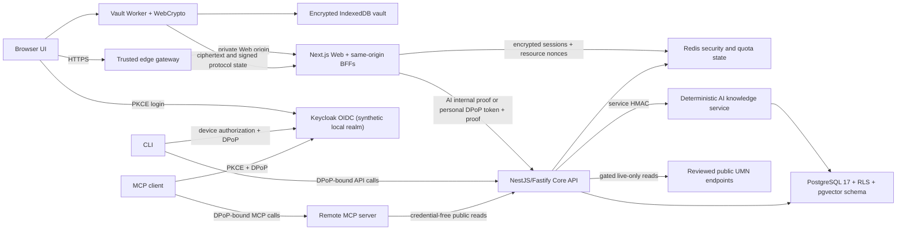

# Architecture

## Status and scope

This document describes the current integrated, pre-production platform. It
distinguishes implemented runtime behavior from development-only fallbacks,
contract-only surfaces, and deployment gates that still prevent a production
readiness claim.

UMN Gopher Assistant is an independent, unofficial project. It has no
University of Minnesota production access or authorization by default. Only
the reviewed public, unauthenticated connectors named below are enabled; other
institutional connectors remain deny-by-default. All current official-status
fields are **UNVERIFIED**, and world content is **schematic**.

## Design goals

- Support Twin Cities, Duluth, Crookston, Morris, and Rochester without
  collapsing campus-specific rules into one implicit default.
- Treat English and Simplified Chinese as first-class presentation locales.
- Carry source provenance, rights, freshness, and verification metadata with
  derived records.
- Publish machine-readable HTTP and event contracts before coupling clients to
  implementations.
- Keep the core easy to run and change as a modular monolith.
- Extract a service only after isolation has a concrete security, scaling,
  availability, or ownership benefit.
- Keep secrets, privileged University systems, and unlicensed assets outside
  the repository.

## Current non-goals

- Claiming University endorsement or official-source status.
- Mirroring University websites or protected student, employee, library, or
  account data.
- Providing production navigation, accessible-route guarantees, emergency
  alerts, evacuation guidance, or dispatch.
- Treating an OpenAPI path, AsyncAPI channel, Compose service, or UI placeholder
  as evidence that the capability is operational.
- Reconstructing campus buildings from copyrighted maps, imagery, or 3D assets
  without a compatible license.

## System context

The production-oriented request and data flow is:

The edge gateway is the supported public production entry for the Web/BFF
tier, but it is not part of the local Compose topology because there is not yet
a production Web container to place behind it. Loopback development and the
managed Playwright server connect to Web directly. That exception is a local
test topology, not permission to expose Web publicly without the gateway and
its network policy.

The web client does not call University systems directly. Connector-specific
authentication, rate limits, licensing rules, and transformations belong behind
server-side ports. A client receives normalized contracts and visible source
attribution. Personal-vault plaintext is rendered in the browser, but only
ciphertext, public authorization descriptors, signed commits, and bounded
protocol metadata cross the BFF/API boundary.

## Repository boundaries

| Boundary               | Responsibility                                                    | Current status                                                                                    |
| ---------------------- | ----------------------------------------------------------------- | ------------------------------------------------------------------------------------------------- |
| apps/web               | Next.js 16.2 field guide, PWA, BFFs, and bilingual experience     | Implemented public views, AI query BFF, OIDC session BFF, and browser vault Worker                |
| apps/api               | NestJS 11/Fastify composition root                                | Implemented public catalog, deterministic AI proxy, and DPoP-protected personal-vault routes      |
| apps/ai-knowledge      | Isolated deterministic campus knowledge retrieval boundary        | Reviewed file corpus in development/test; synchronized PostgreSQL snapshot required in production |
| apps/edge-gateway      | Public TLS proxy and privacy-preserving AI network assertion      | Implemented and containerized; production topology is not yet supplied                            |
| apps/cli               | Device-authorized command-line client                             | Implemented login lifecycle and guarded read operations                                           |
| apps/mcp-server        | OAuth-protected remote Streamable HTTP MCP resource               | Three implemented read-only tools; inbound MCP tokens are never forwarded to Core                 |
| packages/contracts     | Zod schemas, identifiers, shared DTOs, and error shapes           | Contract authority shared by clients and servers                                                  |
| packages/crypto        | Browser-compatible vault encryption and signed protocol artifacts | Implemented v1 local vault and v2 account-bound synchronization primitives                        |
| packages/config        | Five-campus and governed source registries                        | Provenance-bearing records; all current official-status values remain UNVERIFIED                  |
| packages/db            | PostgreSQL schema, ordered migrations, RLS, and repositories      | Authoritative production storage for knowledge and account-bound encrypted vault state            |
| packages/sdk           | Generated TypeScript contract and native fetch client             | Generated from OpenAPI; includes DPoP-aware client behavior                                       |
| packages/testing       | Reusable Vitest configuration and test helpers                    | Workspace support                                                                                 |
| openapi/openapi.yaml   | HTTP contract and compatibility boundary                          | OpenAPI 3.1 with explicit per-operation runtime status                                            |
| asyncapi/asyncapi.yaml | Versioned event envelope and channel contract                     | Design contract; a channel is not proof of a running producer                                     |
| infra/compose          | Local integration dependencies and convergence jobs               | Development topology with migrations and Keycloak reconciliation; not a production prescription   |

The contracts package owns cross-boundary shapes. Domain code should depend on
ports and schemas, not vendor SDKs or infrastructure clients. Adapters translate
between an external representation and a domain representation at the edge.

## Runtime building blocks

| Component            | Current responsibility                                     | Important boundary                                                                                            |
| -------------------- | ---------------------------------------------------------- | ------------------------------------------------------------------------------------------------------------- |
| PostgreSQL           | Knowledge snapshots and account-bound encrypted vault data | Production AI and personal routes require it; the personal runtime role is RLS- and function-restricted       |
| PostGIS              | Geospatial primitives and spatial queries                  | Its presence does not make schematic geometry verified route data                                             |
| pgvector             | Schema and indexes for a future reviewed embedding path    | Embeddings are nullable and current retrieval neither writes nor queries vectors                              |
| Keycloak             | Local standards-based OIDC and DPoP token issuer           | The realm is synthetic and does not authorize University accounts or enable UMN SAML                          |
| Redis                | AI quotas, DPoP nonce/replay state, and Web sessions       | Security state fails closed; production requires authenticated TLS deployments with reviewed eviction policy  |
| Edge gateway         | Public TLS boundary and trusted AI network assertion       | It strips spoofable forwarding/internal headers; the private Web service must not have another public ingress |
| AI knowledge service | Corpus validation and deterministic evidence retrieval     | Core authenticates private queries with a separate service HMAC; the service never reads the personal vault   |
| NATS JetStream       | Available asynchronous-event substrate                     | Current contracts do not prove that a producer or consumer is running                                         |
| Transactional outbox | Schema for a future atomic event handoff                   | It is not part of the current personal-vault commit path                                                      |
| Meilisearch          | Available derived full-text index                          | It is not authoritative and is not required by the implemented retrieval path                                 |
| MinIO                | Available local S3-compatible object storage               | No current workflow may store an object without license, ownership, malware, privacy, and deletion controls   |
| LiveKit              | Available real-time media transport                        | No live media workflow is enabled; recording and room access require explicit consent and authorization       |
| OpenBao              | Local secret-management dependency                         | Local availability is not evidence of production secret injection, rotation, or recovery                      |

These dependencies are selectively used. Running them in local Compose does not
turn the modular monolith into a microservice system, enable a connector, or
establish production readiness.

## API and event contracts

The API is schema-first:

1. Shared schemas define identifiers, localization, provenance, errors, and
   transport payloads.
2. OpenAPI 3.1 documents HTTP operations, pagination, conditional requests,
   idempotency requirements, and problem details.
3. AsyncAPI documents versioned event names and payloads.
4. Controllers validate at the boundary and call domain ports.
5. Adapters implement those ports for in-memory, database, or approved external
   systems.

The implemented runtime surface remains intentionally smaller than the full
contract:

- health;
- campus metadata;
- source metadata;
- a campus world manifest;
- reviewed UMN Sessions metadata for all five campus selections;
- reviewed public event feeds for Twin Cities and Duluth, with explicit
  official-link fallback elsewhere;
- evidence-first bilingual campus knowledge queries with paragraph citations;
  and
- authenticated personal-vault bootstrap, snapshot, creation, payload update,
  device-pairing, approval, cancellation, and key-rotation operations.

The Web exposes same-origin BFF routes for AI, authentication, and personal
vault access. Those routes are not alternative trust authorities: the Core API
still performs request validation, exact-audience OIDC verification, DPoP proof
and replay checks where required, owner resolution, authorization, and database
enforcement. The public OpenAPI `x-runtime-status` value is the machine-readable
authority for implemented versus contract-only operations.

Community, messaging, live media, model generation/BYOK, and broader write
operations in the contracts remain compatibility targets. A consumer must not
depend on them until runtime availability is explicitly documented and tested.

## Campus and localization model

Campus identity is explicit on campus-scoped data. The supported identifiers
are **tc**, **duluth**, **crookston**, **morris**, and **rochester**. Rochester
currently maps academic-calendar behavior to Twin Cities only where the
configuration says so; that mapping is not a general rule for other domains. Academic institution identity is
modeled independently: Rochester and Twin Cities map to **UMNTC**, Duluth to **UMNDL**, Crookston to **UMNCR**,
and Morris to **UMNMO**. An institution code is not interchangeable with a campus ID or calendar routing rule.

User-visible registry values carry both **en** and **zh-CN** strings. Machine
identifiers, timestamps, coordinates, units, and source URLs are locale-neutral.
Fallback to English must be visible and must not fabricate a translation. A
translation is derived content and retains a link to its source.

## Provenance and trust model

Each external source record includes, at minimum:

- a stable source identifier and applicable campus identifiers;
- bilingual display names;
- publisher and HTTPS source URL;
- licensing status and attribution;
- cache policy;
- freshness and verification states;
- last-check evidence when available;
- official-status evidence.

Campus home pages are registered as **DEEPLINK_ONLY** with
**NO_CONTENT_CACHE**. Their public availability permits linking, not wholesale
copying. See [Data source policy](data-source-policy.md).

AI citations deliberately keep two source roles separate:

- `summarySource` identifies the Apache-2.0, project-authored corpus and exact
  corpus revision used to produce the paragraph; and
- `verificationLink` identifies a governed official UMN entrance that the user
  may open to check current details. It is `DEEPLINK_ONLY`, is marked
  `verification-link-only`, and always states `contentRetrieved: false`.

The paragraph, excerpt, content hash, update time, freshness, and schematic
review state describe the project summary, never the linked UMN page. The
retrieval service does not fetch or embed that page. File and PostgreSQL
repositories validate the same governed source roles before a snapshot can be
served. See [ADR 0006](adr/0006-explicit-ai-citation-provenance.md).

Live public catalog records use a different evidence model: they carry bounded
source observations and coverage from the reviewed live-only request. They are
not copied into the AI corpus, and a failed live request does not replay an old
response as if it were current.

Three independent labels must remain distinct:

- **Schematic** describes approximate project-authored representations, such as
  a placeholder world manifest.
- **Verified** describes review of a particular fact or artifact against
  documented evidence.
- **Official** would describe an authorized institutional relationship.

Verification never creates official status. A verified community-authored
geometry can still be unofficial. Conversely, an official page may still be too
stale or restrictively licensed for a proposed use.

## Connector lifecycle

New or unreviewed connectors start disabled. The reviewed, public, live-only
Sessions connectors for all five campus selections and the Twin Cities/Duluth
event connectors are enabled by default only while their runtime switch and
review evidence remain valid. Enabling any other connector requires:

1. a named owner and bounded purpose;
2. a source-registry entry and data-flow inventory;
3. documented license, terms, robots, and authorization review;
4. an authentication design with least privilege and secret rotation;
5. privacy, retention, deletion, caching, and attribution rules;
6. schema validation, rate limits, timeouts, and circuit breakers;
7. fixtures and tests that contain no real credentials or protected records;
8. an operational kill switch and incident owner;
9. approval evidence linked from deployment configuration, not implied by code.

The application fails closed when an approval artifact, secret, or verification
record is missing. A mock adapter can support development but must be visibly
marked as mock or schematic.

## Implemented data flows

### Evidence-first query

1. The browser sends a same-origin, unauthenticated AI request to the Web BFF.
   It carries no OIDC or personal credential, but it may carry the opaque signed
   HttpOnly quota-session cookie established by the BFF.
2. In production, the trusted edge supplies a short-lived assertion for a
   privacy-preserving network bucket. The BFF establishes an opaque anonymous
   session and signs a separate short-lived internal proof for Core.
3. Core validates the request. A valid BFF proof selects its opaque session and
   network buckets; a missing or invalid proof is conservatively mapped to
   domain-separated socket identities. Core then atomically charges client,
   network, and global Redis quotas. Redis failure denies the query.
4. Core signs the exact private request body, trace ID, timestamp, and nonce
   with the service HMAC and calls the isolated knowledge service.
5. The knowledge service filters by campus before ranking, rejects weak
   evidence, and reads a fully validated corpus snapshot. Production requires a
   successfully synchronized PostgreSQL snapshot; file mode is development and
   test only.
6. Pydantic, Zod, OpenAPI, the generated SDK, Core, the BFF, and the browser all
   enforce the same response shape and the separate summary/verification roles.

This path invokes no generative model, fetches no official verification page,
and has no route to the personal vault.

### Account-bound encrypted vault write

1. The browser Worker encrypts the payload and constructs the owner-, vault-,
   parent-, and operation-bound signed protocol artifacts. It transactionally
   stages the exact command and successor state in IndexedDB before network
   transmission.
2. The Web BFF uses the user's server-side OIDC session and DPoP key. It forwards
   only ciphertext, public authorization descriptors, signed commits, and
   bounded protocol metadata to Core.
3. Core rejects Bearer fallback, verifies the exact issuer, audience, approved
   client, `cnf.jkt`, DPoP URL/method/token binding, nonce, and proof replay.
4. Core resolves the issuer/subject through a purpose-separated HMAC identity
   and opaque random owner binding. A pre-listen database continuity check
   prevents an unsafe identity-HMAC deployment or rotation from splitting an
   existing account.
5. Core verifies the public signatures and strict artifact relationships. The
   personal service and transactional repository enforce parent, idempotency,
   authorization, pairing, and rotation transitions through the restricted
   PostgreSQL runtime role, forced RLS, row locks, and compare-and-set writes.
   Separate reviewed `SECURITY DEFINER` functions are limited to account
   resolution, HMAC continuity, and maintenance boundaries.
6. The Worker accepts a result only after the returned snapshot and ETag match
   the staged successor. Recovery and root-key rotation require an independent
   signed read-back before ordinary writes resume.

The server never receives task plaintext, a vault root key, a recovery code, or
a device private key. A development process without
`API_PERSONAL_DATABASE_URL` uses an explicit non-durable in-memory repository;
production requires the PostgreSQL/RLS adapter with `sslmode=verify-full`.

### Contracted future event flow

The transactional-outbox and AsyncAPI model remains the required design for a
future asynchronous domain write: state and outbox record commit together,
publishers retry to NATS JetStream, and consumers apply versioned events
idempotently. No current personal-vault operation depends on that future path,
and the presence of an outbox table or channel is not evidence of a running
publisher. Search and cache indexes remain derived rather than authoritative.

## Selective service extraction

The default deployment unit is the modular API. A module is considered for
extraction only when evidence shows that an independent boundary is safer or
more operable. The current knowledge service isolates corpus/database access
and service authentication from Core, while the edge gateway isolates public
network identity and header trust from Web. Other examples include:

- media workloads needing independent network and resource isolation;
- connector workers with different credentials and failure modes;
- high-volume indexing or ingestion with separate scaling characteristics;
- a security boundary that materially reduces blast radius;
- a stable ownership boundary with an explicit service-level objective.

Extraction requires a versioned contract, isolated data ownership, idempotent
messaging, dashboards, runbooks, and a rollback plan. Shared database tables and
distributed transactions are not acceptable substitutes for a real boundary.
See [ADR 0001](adr/0001-selective-service-architecture.md).

## Security and privacy invariants

- Authorization is checked server-side at every protected boundary.
- Protected Core and MCP resources require RFC 9449 DPoP-bound `at+jwt`
  access tokens with exact issuer, audience, approved client, and URL/method
  binding. A copied Bearer token is not a compatibility fallback.
- Browser tokens, refresh tokens, and the Web DPoP private key remain in the
  server-side BFF session rather than browser JavaScript or Web Storage.
- The public edge removes forwarding, ingress-assertion, and internal-proof
  headers supplied by a client before it creates its own bounded assertion.
- A campus identifier is not an authorization decision.
- Source HTML, documents, connector responses, and model output are untrusted
  input.
- Credentials and tokens are never logged, committed, placed in fixtures, or
  sent to a language model.
- AI retrieval never reads personal-vault state and the current no-key path
  never invokes a language model.
- Personal-vault plaintext and secret key material remain client-side. Server
  persistence is ciphertext plus public and signed protocol state, protected by
  tenant RLS and least-privilege runtime functions.
- The live vault and device-key handles remain in a module Worker. Browser
  support, non-extractable `CryptoKey` storage, short unlock lifetimes, CSP,
  service-worker policy, and XSS prevention are still part of the boundary;
  non-extractable does not mean hardware-isolated.
- Security and identity HMAC keys are purpose-separated. Account identity-key
  versions and continuity are registered and checked before the API listens.
- Logs minimize personal data and use request or event identifiers rather than
  raw payloads.
- Retrieval and search preserve the authorization scope of the underlying
  record.
- Any future file or media workflow must validate content type, size, malware
  status, license, and consent before it is enabled.
- Community and AI content is never promoted to verified campus information
  without human review and evidence.
- The Service Worker does not cache authenticated or personal endpoints,
  personal data, ciphertext, keyrings, or recovery material.

The detailed abuse cases and controls are in the [threat model](threat-model.md)
and [security policy](../SECURITY.md). See also
[ADR 0007](adr/0007-account-bound-e2ee-sync.md) and
[ADR 0008](adr/0008-dpop-proof-of-possession.md).

## Safety-critical launch gates

The following remain disabled until a separate documented safety review:

- accessible, mobility, evacuation, and emergency routing;
- real-time emergency-alert interpretation or replacement;
- indoor positioning or precise individual location sharing;
- automated changes to verified geometry;
- advice that could be mistaken for police, medical, fire, or University
  instructions.

Any enabled route must identify its source, checked time, intended mobility
profile, and known limitations. A schematic route is never silently upgraded to
a verified route. When evidence is missing or stale, the product deep-links to
the current official resource.

## Deployment posture

Local Compose supports development and integration tests. Production deployment
requires separate decisions for network segmentation, managed data services,
backups, key management, audit logging, recovery objectives, regional
availability, privacy notices, and operator ownership. The repository is
production-oriented but does not yet claim production readiness.

All Compose-published ports bind to `127.0.0.1` by default. Changing
`COMPOSE_BIND_ADDRESS` is an explicit exposure decision, not a deployment
default. The local PostgreSQL image uses a digest-pinned PostGIS base and a
checksum-pinned pgvector source. A one-shot migration service verifies the
repository checksum of every applied migration and transactionally upgrades
both empty and retained volumes before data-dependent services start. A second
one-shot service idempotently reconciles the retained Keycloak realm because
startup import alone cannot update an existing realm. Database runtime grants
are converged to the reviewed account/personal-vault function allowlist.

`pnpm smoke:db` reproduces and verifies the foundation-only to current-schema
upgrade when a Docker engine is available. Separate identity, DPoP, MCP OAuth,
catalog, AI stack, and personal-vault maintenance smokes exercise boundaries
that a build or typecheck cannot prove.

The edge gateway is implemented, containerized, and is the required public
production Web entry. It neither fronts Core/MCP nor satisfies their required
distributed invalid-token and global pre-authentication ingress limit. A
deployable production Web container, network policy, managed TLS/secret wiring,
and target-environment source-IP preservation proof are still absent. The local
Compose file therefore intentionally does not pretend to be the production
edge/Web topology.

`GET /v1/health` is process liveness only. It does not probe the required Redis,
personal PostgreSQL/RLS, OIDC/JWKS, catalog, or AI dependencies. The edge
gateway's `/readyz` proves only that its configured Web upstream answers. A
bounded composite Core readiness probe or equivalent external synthetic gate
is still required before a load balancer, rollout controller, or service-level
objective treats the application as ready. See [API health](health.md).

## Development and local-only modes

- Development and tests may omit `API_PERSONAL_DATABASE_URL`; Core then uses a
  non-durable in-memory personal repository. Production startup rejects that
  fallback.
- Development and tests may run the AI service against the reviewed file
  corpus. Production startup requires a valid PostgreSQL snapshot, service
  HMAC, and TLS-enabled database URL; there is no file fallback.
- A browser vault marked **Local only** is genuinely encrypted and usable
  offline, but it is not a remote backup. Clearing site data or losing local
  ciphertext makes it unrecoverable. A recovery code enables cross-device
  recovery only after authenticated account synchronization completes.
- Local Keycloak users, clients, roles, and credentials are synthetic. They do
  not provide UMN SSO or access to University accounts.
- Checked-in local credentials are development fixtures and must never be
  promoted, reused, or treated as secret-manager evidence.

## Known current limitations

- There is no reviewed production deployment, composite Core readiness probe,
  institutional authorization, UMN SAML integration, or production operator
  commitment.
- There is no reviewed public Core/MCP ingress topology or distributed
  invalid-token/global pre-authentication limiter. The Web edge's AI network
  assertion is a different, narrower boundary.
- Campus/source/world registry reads remain configuration-backed or in-memory;
  durable PostgreSQL authority currently applies to the production knowledge
  snapshot and account-bound encrypted-vault state, not every domain.
- Current project-authored AI summaries are schematic and not independently
  verified against the linked pages. Vector search, generative models, BYOK,
  and local-model connections remain disabled.
- Public Sessions are live-only for all five campus selections; public event
  feeds are live only for Twin Cities and Duluth. Other event campuses use an
  official deep link or approval-required fail-closed state.
- Weather, personal class schedules, route rehearsal, community content, and
  moderation views are authored demonstrations or contract-only unless the UI
  displays explicit provenance saying otherwise.
- Community, messaging, live-media, broader admin/write workflows, and active
  outbox/NATS consumers remain contract-only or disabled.
- Core-to-knowledge HMAC nonce replay state is process-local and is lost on
  restart. Catalog connector bulkhead, rate, and circuit state is also
  process-local, so multi-replica egress still needs a reviewed aggregate
  limiter and coordinated operational policy.
- The encrypted-vault protocol detects rollback only relative to a trusted
  local anchor; it does not yet provide global fork transparency against a
  malicious storage service. Automated retention scheduling and a complete
  user-facing account-erasure lifecycle are also not shipped.
- An existing personal database requires the documented one-time known-good
  account-HMAC continuity bootstrap. Dormant accounts can delay rotation
  finalization, and pairing expiry still partly depends on application-clock
  evaluation rather than a single database clock.
- The private vault requires the reviewed browser primitives. Safari/iOS
  releases before 26 fail closed because their Worker/IndexedDB transaction
  behavior does not meet the vault's persistence requirement.
- Keycloak 26.7 does not implement the MCP `resource` parameter required by RFC 8707. The current strict MCP client/server profile is documented and tested
  but is not generic-client compatibility.
- All current official-status records remain UNVERIFIED; world geometry is
  schematic; and safety-critical navigation, alerts, accessibility guarantees,
  and emergency guidance remain disabled.

Update this document whenever a boundary, data owner, enabled connector, or
safety posture changes.
